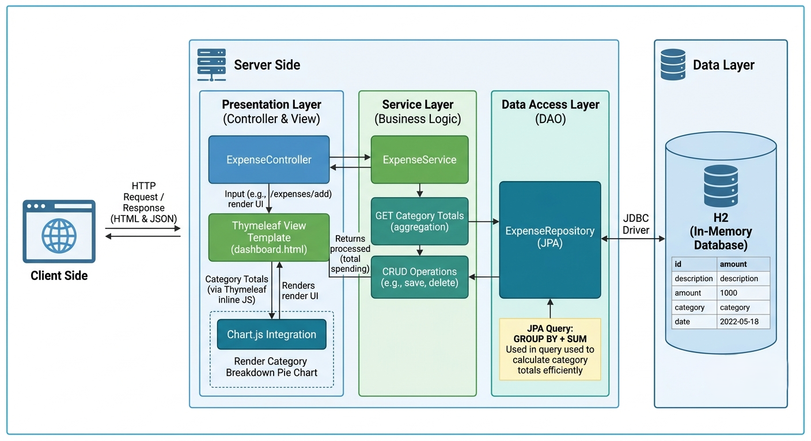
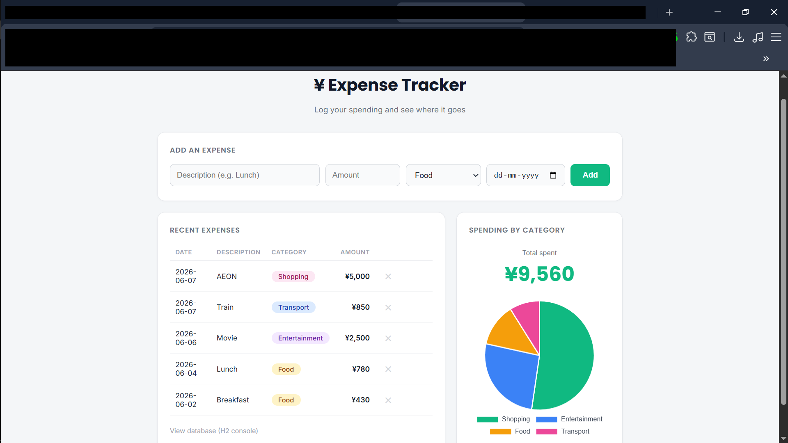

# Expense Tracker(支出管理アプリ)

**言語:** [English](README.md) | [日本語](README.jp.md)

---

カテゴリ別の円グラフ付き、シンプルな支出管理アプリです。Spring Boot + Thymeleafで作成しました。
支出を記録すると、合計金額とカテゴリ別の円グラフが表示されます。

## 概要

最初の「ジュニアJavaエンジニア」向けプロジェクトとしてURL短縮サービスを作成した後、
少し異なるスキル(カテゴリ別の集計とグラフによる可視化)を含む2つ目のプロジェクトとして作成しました。
基本的なCRUD操作も含まれています。

## 仕組み



1. ホームページに支出を追加するフォーム(説明、金額、カテゴリ、日付)が表示される
2. 送信すると、支出データがデータベースに保存される
3. ページが再表示され、更新された支出一覧・合計金額・カテゴリ別の円グラフが表示される
4. 各支出は一覧から削除できる

## 使用技術

- Java 17
- Spring Boot 3.2(Web + Thymeleaf + JPA)
- H2(インメモリデータベース — 別途データベースサーバー不要)
- 円グラフ表示にChart.js
- フォーム入力の検証にJakarta Validation

## 画面



## 実行方法

```bash
mvn spring-boot:run
```

その後、`http://localhost:8080` を開いてください。

データベースはインメモリ(H2)のため、アプリを再起動するとデータはリセットされます。
`http://localhost:8080/h2-console` から直接データベースを確認できます
(JDBC URL: `jdbc:h2:mem:expensetracker`、ユーザー名: `sa`、パスワードなし)。

## 設計についての補足

- **カテゴリ別の合計**は、`GROUP BY` と `SUM` を使った1つのJPAクエリで計算しています。
  すべての支出データを読み込んでJava側で合計するのではなく、
  プロジェクションインターフェースを使って `(カテゴリ, 合計)` のペアの
  リストとして直接取得しています。

- **グラフ**はChart.jsで描画しています。コントローラーからテンプレートに
  渡されたカテゴリ別の合計データは、Thymeleafの `th:inline="javascript"` を
  使ってJavaScriptの配列としてそのまま埋め込まれるため、追加のAPI呼び出しなしで
  常に最新のデータがグラフに反映されます。

## 作成者

Krish — [GitHub](https://github.com/krishfemto)
